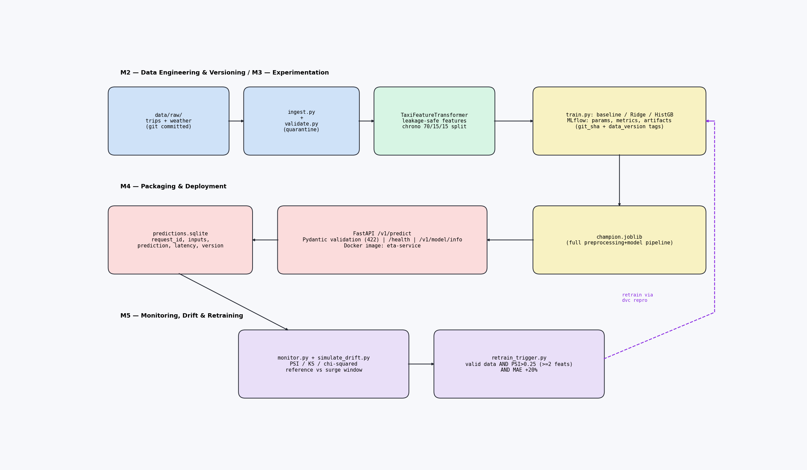

# NYC Taxi Trip Duration Prediction

End-to-end ML mini-project (ZC412, Flavor A): given a pickup time and place, a
drop-off, passenger count, and the day's weather, it predicts how long the trip
will take. The best model is off by **~1.2 minutes on average** (74.2 s test
MAE — 2.9× better than always guessing the median).

The dataset is **fully synthetic** (the brief explicitly allows this) and
generated by a fixed random recipe, so the whole project reproduces on any
machine with zero downloads.



## How to run

```bash
# 1. setup (once)
python3 -m venv .venv && .venv/bin/pip install -r requirements.txt

# 2. build everything: ingest -> validate -> train
.venv/bin/dvc repro

# 3. browse the experiment runs
.venv/bin/mlflow ui --backend-store-uri sqlite:///mlflow.db   # http://127.0.0.1:5000
```

### Serve predictions

```bash
# local
.venv/bin/uvicorn src.api.app:app --app-dir .

# or in Docker (run `dvc repro` first so models/ exists)
docker build -t eta-service . && docker run -p 8000:8000 eta-service
```

```bash
curl -X POST http://127.0.0.1:8000/v1/predict \
  -H 'content-type: application/json' \
  -d '{"pickup_datetime":"2016-03-15T08:30:00","pickup_longitude":-73.98,"pickup_latitude":40.75,"dropoff_longitude":-73.96,"dropoff_latitude":40.76,"passenger_count":1,"temp_c":4.0,"precipitation_mm":0.0,"weather":"clear"}'
# -> {"model_version":"1.0.0","predicted_duration_minutes":8.49, ...}
```

The API checks every input (NYC coordinate bounds, 1–6 passengers, valid
weather word); bad input gets HTTP 422, never a made-up answer. Every request
is logged to `monitoring/predictions.sqlite`. `GET /health` returns 503 if the
model file is missing.

### Monitoring demo

```bash
.venv/bin/python scripts/simulate_drift.py        # fake a rush-hour surge
.venv/bin/python scripts/run_retraining_check.py  # -> {"action": "retrain_and_compare"}
```

## How it works

Three DVC stages (`dvc.yaml`), each skipping itself when nothing changed:

1. **ingest** — reads the committed trips + weather CSVs, joins weather onto
   trips by pickup date, writes `data/interim/ingested_trips.csv`.
2. **validate** — applies quality rules (timestamps parse, GPS inside NYC,
   1–6 passengers, 30 s–2 h durations, drop-off after pickup, valid weather).
   Rejected rows go to `data/quarantine/invalid_rows.csv` **with a written
   reason each** (787 / 50,000 rows on the committed data); counts land in
   `data/processed/validation_report.json`. The stage fails only if zero
   usable rows remain.
3. **train** — sorts trips by time (oldest 70% train, next 15% validation,
   newest 15% test), builds features (distance, pickup hour, weekday, rush-hour
   flags, weather), trains three models, logs everything to MLflow, and saves
   the winner to `models/champion.joblib`. Features are built *inside* the
   saved pipeline, so serving uses exactly the same logic as training.

After training, `simulate_drift.py` skews the data to a rush-hour surge and
measures the damage; `run_retraining_check.py` decides whether to recommend
retraining.

## Results

| Model | Test MAE | vs baseline |
|---|---|---|
| Median baseline | 213.9 s | — |
| Ridge regression | 90.2 s | 2.4× |
| **Gradient boosting (champion)** | **74.2 s (~1.2 min)** | **2.9×** |

The drift simulation degrades the champion from 73.4 s to 155.7 s MAE (2.12×),
which correctly fires the retraining recommendation.

## Decisions & assumptions

- **Synthetic data, on purpose.** The brief allows it. The generator
  (`scripts/create_sample_data.py`, seed 7) builds in rush hours, weekends, and
  rain effects, and dirties ~1.5% of rows so validation has real work. Both
  CSVs are git-committed; `dvc.lock` pins their hashes; dataset tag:
  `data-v1.0`.
- **Time-based split, not random.** The test set is always "the future", so no
  information from later trips leaks into training.
- **Champion picked by score.** Lowest validation MAE wins; the test set is
  used once, only to report. Gradient boosting beats ridge because it captures
  non-linear effects (rush hour × distance) a straight line cannot.
- **Retraining is a recommendation, not automatic.** The trigger
  (`src/monitoring/retrain_trigger.py`) fires only when all three hold: the new
  data passes validation, drift is severe (PSI > 0.25 on 2+ features), and
  accuracy dropped 20%+. A human then reruns the pipeline and promotes the new
  model only if it wins.
- **No live traffic feed.** Time-of-day and rush-hour flags stand in for real
  traffic.
- **Evidence for review is committed** in `evidence/` (MLflow run table,
  comparison, model metadata) — regenerate with
  `.venv/bin/python scripts/export_evidence.py`.

## Reproduce from scratch

```bash
python3 -m venv .venv && .venv/bin/pip install -r requirements.txt
.venv/bin/dvc repro --force
.venv/bin/python scripts/simulate_drift.py
.venv/bin/python scripts/run_retraining_check.py
.venv/bin/python scripts/export_evidence.py
```

All metrics are deterministic (seeded data, seeded models); only MLflow run
IDs differ between machines.

## Project structure

```text
scripts/           one thin entry point per step (run_*, simulate_*, export_*)
src/data           ingestion + validation (quarantine with reasons)
src/features       feature engineering + chronological split
src/models         training, MLflow tracking, champion selection
src/api            FastAPI service (validation, logging, /health 503)
src/monitoring     drift metrics (PSI/KS/chi-squared) + retraining guard
data/raw           committed synthetic dataset (seed 7)
models/            champion artifact (gitignored, rebuild via dvc repro)
evidence/          committed review snapshots
monitoring/        drift report + retraining decision (committed), request log (runtime)
```

Dependencies are pinned in `requirements.txt` (pandas, scikit-learn, mlflow,
dvc, fastapi, uvicorn, joblib, scipy, numpy).
